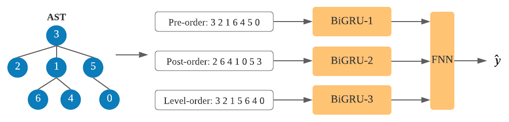

# Code Classification

## How to run the code

### Requirements

The code is tested in the following environment.

* python 3.8.5
* pytorch 1.7.0
* pandas 1.1.3
* numpy 1.19.2
* gensim 3.8.3
* pycparser 2.20
* tqdm 4.50.2


### Code files

There are five *.py files.

* train.py: The main file, which also defines some hyper-parameters. 

* model.py: Implement the deep model. 

* dataset.py: Preprocess original data.

* parsetree.py: Define three method of traversing AST tree, including pre-order traverse, post-order traverse and level-order traverse.

* utils.py: Define some basic functions which might be used in other code file.

  

### Run the code

1. Data Preparation.

   ```python
   python3 dataset.py
   ```

2. Train the model.

   ```python
   python3 train.py
   ```

   or  you can use the pretrained word embedding. (In our experiment, pretraining word embedding does not improve performance.)

   ```
   python3 train.py --use_pretrain
   ```

   Also, you can specify other hyper-parameters by
   
   ```
   python3 train.py --batch_size 128 --log_dir ./logs/
   ```
   
   More hyper-parameters can be specified, and you can find them in the train.py. The training loss and valid accuracy are recorded in the ./logs
   
   We find the best model based on the valid accuracy. And the best model during training is also saved in ./models/best.model (default).
   
3. You can use the trained model to evaluate. 

   ```
   python3 train.py --only_test --model_dir ./models_best
   ```

   ./models_best/best.model is our trained model. You can specify your own trained model.


### Results

We adopt the model at the training iteration with the lowest valid accuracy for evaluation in the test set.

The hyper-parameters are shown in train.py. We fix the random seed, so you can get the similar results. 

(If you want to train the model on GPU with default hyper-params, make sure your GPU has at least 8G memory.)

* Final_Model. 
* Use-Pretrained-Emb: Use pretrained word embedding. 
* One_BiGRU: For the pre-order/post-order/level-order sequences, use one BiGRU to process them.
* One_Seq: Only use pre-order traverse sequence.

|          | Final_Model | Use Pretrained Emb | One_BiGRU | One_Seq |
| -------- | ----------- | ------------------ | --------- | ------- |
| Test ACC | 0.9843      | 0.9811             | 0.9723    | 0.9771  |


## Algorithm & What the code does

### Data Preparation

1. The original datasets "./data/train.pd", "./data/valid.pd", "./data/test.pd", contain c source code and the corresponding label. There are total 104 unique labels.
2. We convert c source code to Abstract Syntax Tree (AST) with the tool pycparser. 
3. For each AST, we apply pre-order traverse, post-order traverse and level-order traverse to generate three node sequences, the node is represented by the token of its name. Thus, we generate three files "./data/train_ast.pkl", "./data/valid_ast.pkl", "./data/test_ast.pkl". 
4. Use pre-order, post-order, level-order sequences of train set to train Word2Vec mode, and get the word embedding. The trained word embedding is used as the initial embedding of the downstream model.


### Model



1. For each AST, we generate three sequences using pre-order traverse, post-order traverse, level-order traverse. Since some sequence might have very large length,  we limit the maximum sequence length to 1024, you can also adjust '--max_seq_len' in train.py
2. We apply three bidirectional GRU models to process these three types of sequences. We store the hidden states of GRU at each time step, and use max pooling to aggregate them.
3. After step 1 and 2, we get three vectors. We concatenate the three vectors, and apply three layer feed-forward neural network to make the final prediction.


